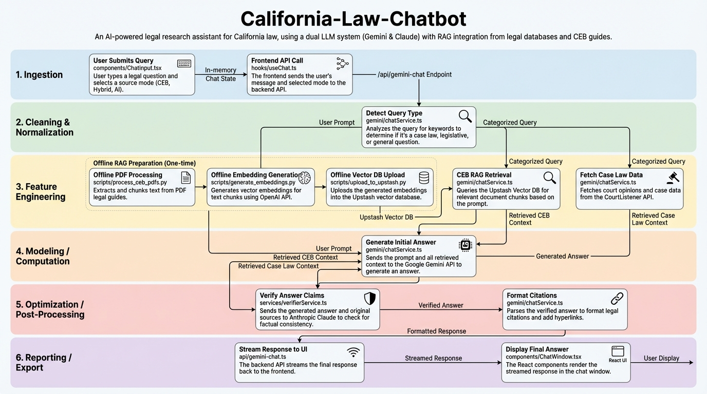

# GitHub to Nano Banana Infographic

**Automatically generate beautiful data pipeline infographics from any GitHub repository using AI.**

This tool uses Google's Gemini models to:
1. **Analyze** your codebase and understand its execution flow
2. **Extract** the data pipeline architecture (entry points, data flow, external services)
3. **Generate** a professional 16:9 infographic visualization

Perfect for documentation, presentations, onboarding, and technical design reviews.

---

## ✨ Example Output

Here's an infographic generated for the [California-Law-Chatbot](https://github.com/ArjunDivecha/California-Law-Chatbot) repository:



The tool automatically identified:
- **Offline ingestion pipeline**: PDF processing → Chunking → Embedding → Vector DB
- **Online query pipeline**: User input → RAG retrieval → LLM generation → Verification → UI display
- **Decision logic**: Source mode selection (CEB Only, Hybrid, AI Only)
- **Feedback loops**: Two-pass verification system (Gemini → Claude)
- **External services**: OpenAI, Anthropic, CourtListener, Upstash

---

## 🚀 Quick Start

### 1. Clone and Install

```bash
git clone https://github.com/ArjunDivecha/GitHub-to-nanobanana-infographic
cd GitHub-to-nanobanana-infographic

python -m venv .venv
source .venv/bin/activate  # Windows: .venv\Scripts\activate
pip install -r requirements.txt
```

### 2. Configure API Key

```bash
cp .env.example .env
```

Edit `.env` and add your Gemini API key:
```
GEMINI_API_KEY=your_api_key_here
```

Get your API key from [Google AI Studio](https://aistudio.google.com/app/apikey).

### 3. Generate Your First Infographic

```bash
python repo2infographic.py https://github.com/owner/repo-name
```

**Output:**
- `repo2infographic_output/repo-name.json` – Structured pipeline data
- `repo2infographic_output/repo-name.png` – Beautiful 16:9 infographic

---

## 📖 Usage

### Basic Usage

```bash
python repo2infographic.py https://github.com/ArjunDivecha/California-Law-Chatbot
```

### Custom Output Directory

```bash
python repo2infographic.py https://github.com/owner/repo --out-dir my_output
```

### Custom Models

```bash
python repo2infographic.py https://github.com/owner/repo \
  --text-model gemini-2.5-pro \
  --image-model gemini-3-pro-image-preview
```

### Available Options

```
python repo2infographic.py --help
```

### Apply visual styles:

Add a `--style` flag to customize the aesthetic of your infographic:

```bash
# Lego brick style
python repo2infographic.py https://github.com/owner/some-repo --style lego

# Studio Ghibli anime aesthetic
python repo2infographic.py https://github.com/owner/some-repo --style ghibli

# Cyberpunk neon aesthetic
python repo2infographic.py https://github.com/owner/some-repo --style cyberpunk

# Clean minimalist design
python repo2infographic.py https://github.com/owner/some-repo --style minimalist

# Technical blueprint style
python repo2infographic.py https://github.com/owner/some-repo --style blueprint

# Hand-drawn sketch style
python repo2infographic.py https://github.com/owner/some-repo --style hand-drawn
```

**Available styles:**
- `lego` - Bright primary colors, blocky shapes, toy-like 3D appearance
- `ghibli` - Hand-drawn watercolor feel, whimsical Studio Ghibli aesthetic
- `cyberpunk` - Neon colors, dark background, futuristic tech aesthetic
- `minimalist` - Clean lines, whitespace, simple sans-serif fonts
- `blueprint` - Technical drawing with blue background and white lines
- `hand-drawn` - Sketchy lines, notebook paper feel, casual doodle aesthetic

You can also specify custom styles like `retro`, `corporate`, `vaporwave`, etc.

---

## 🧠 How It Works

### 1. Gemini 2.5 Pro analyzes the repo and produces a JSON pipeline spec.
The tool uses **Gemini 2.5 Pro** with the URL context tool to:
- Read the entire repository directly from GitHub (no cloning needed)
- Identify entry points (`main.py`, `app.py`, `index.tsx`, etc.)
- Trace execution flow and data movement
- Detect decision nodes (if/else logic)
- Find feedback loops and retry mechanisms
- Label external API calls

### 2. Architecture Detection
Automatically handles different application types:
- **ETL/Scripts**: File → Processing → Output
- **Web Apps**: Request → Router → Controller → Service → Database → Response
- **CLIs**: Command → Handler → Logic → Output
- **Chatbots**: User Input → Message Handler → LLM → Response

### 3. Pipeline Extraction
Generates a structured JSON with:
- **Phases**: Ingestion, Cleaning, Feature Engineering, Modeling, Optimization, Reporting
- **Steps**: Each with source nodes, process scripts, target nodes, and descriptions
- **Metadata**: Decision logic, external services, feedback loops

### 4. Visual Generation
**Image Model (Infographic)**
   It feeds that JSON into Nano Banana Pro (`gemini-3-pro-image-preview`) with layout instructions:
   - Phases as horizontal swimlanes
   - Labeled boxes for steps
   - Arrows showing data flow
   - Clean, professional design

---

## 🎯 What It Captures

- ✅ **Entry points** and main execution paths
- ✅ **Data flow** (files, APIs, databases, in-memory objects)
- ✅ **Decision logic** (branching based on config/mode)
- ✅ **Feedback loops** (retries, verification)
- ✅ **External services** (OpenAI, Anthropic, AWS, etc.)
- ✅ **Offline vs. Online** pipelines
- ✅ **Multi-stage architectures** (RAG, two-pass systems)

---

## 📊 Best Practices

### Works Great For:
- Data processing pipelines
- ML/AI applications with RAG
- Web applications with clear service layers
- CLI tools with defined workflows
- Chatbots and conversational AI

### Tips for Best Results:
- Ensure your repo has clear entry points
- Use descriptive file and function names
- Add comments for complex logic
- Keep architecture modular

### Limitations:
- Works best on small-to-medium repos (< 1000 files)
- Requires public GitHub repos (or provide authentication)
- May oversimplify very complex monorepos
- Treat output as a starting point for refinement

---

## 🛠️ Advanced Features

### Fallback Logic
If `gemini-3-pro-preview` is overloaded, the tool automatically falls back to `gemini-2.5-pro`.

### Markdown Handling
Automatically strips markdown code blocks from model responses for robust JSON parsing.

### Smart Naming
Output files are named after the repository (e.g., `California-Law-Chatbot.png`) instead of generic names.

---

## 🤝 Contributing

Contributions welcome! Feel free to:
- Report bugs
- Suggest features
- Submit pull requests
- Share example infographics

---

## 📝 License

MIT License - feel free to use this for any purpose.

---

## 🙏 Acknowledgments

Built with:
- [Google Gemini](https://ai.google.dev/) for code analysis and image generation
- [Nano Banana Pro](https://ai.google.dev/gemini-api/docs/models/gemini#nano-banana-pro) for infographic creation
